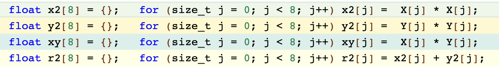
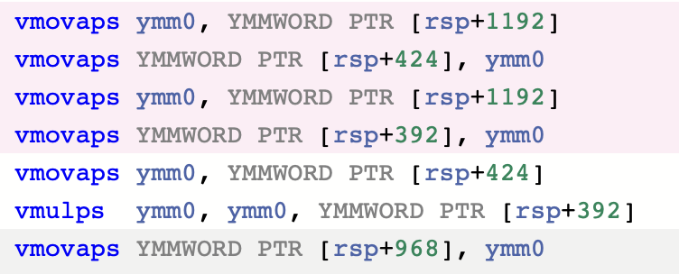
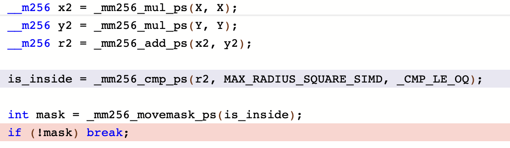
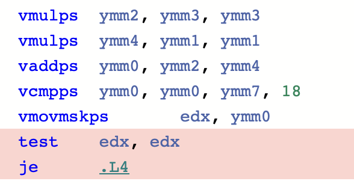
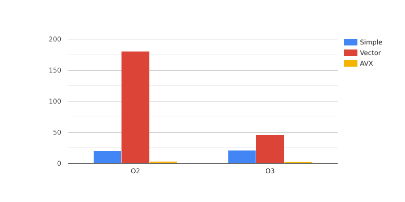

# Лабораторная работа: "Использование SIMD инструкций процессора для ускорения работы программы."

## Содержание

1. [Задача](#задача)
2. [Используемое оборудование](#используемое-оборудование)
3. [Построение фрактала](#построение-фрактала-мандельброта)
  - [Построение](#построение)
  - [Полученное изображение](#полученное-изображение)
  - [Управление изображением](#управление-изображением)
4. [Ход работы](#ход-работы)
  - [Способ измерения](#способ-измерения-скорости-работы-программы)
  - [Первая версия](#первая-версия-программы)
  - [Вторая версия](#вторая-версия-программы)
  - [Третья версия](#третья-версия-программы)
  - [Итоговая таблица](#итоговая-таблица)
5. [Итоги](#итоги)

## Задача

### 1) Написать три варианта программы, рисующей фрактал Мандельброта:
- **1 вариант:** `Наивная реализация:` программа без каких-либо улучшений.
- **2 вариант:** `Векторная реализация:` использовать массивы из 8 элементов.
- **3 вариант:** `SIMD реализация:` использовать SIMD инструкции, поддерживаемые процессором.

### 2) Сравнить скорости работы трех вариантов программы.

### 3) Может ли оптимизатор сам использовать SIMD инструкции.

## Используемое оборудование

### Программы запускаются и тестируются на удаленном сервере:
**Данные о СPU:**

**Операционная система:** Linux Ubuntu 22.04

**Компилятор:** `gcc version 11.4.0`, target: `x86_64-linux-gnu`

## Фрактала Мандельброта

### Построение

**Точки рассчитываются по следующей формуле:**
- xn = xn-12 - yn-12 + x0
- yn = 2 * xn-1yn-1 + y0

**Формат изображения:**

- Размер изображения: 800*600 пикселей
- Радиус окружности, при выходе за которую, расчет точек прекращается: 10
- Максимальный индекс точки, при котором считается, что она не покинула окружность: 255
- Цвет пикселя, заданный для библиотеки SFML, в зависимости от индекс `N` точки:
  - если `N` >= 256, то точка черная
  - если `N` < 256, то

    | R        | G            | B  | Alpha |
    |:--------:|:------------:|:--:|:-----:|
    | 255 - `N` | `N` % 8 * 32 | `N` | 255 |

### Полученное изображение

### Управление изображением

- стрелочками можно двигать изображение
- `A` - уменьшить, `Z` - увеличить
- при зажатой клавише `Shift` все смещение картинки при нажатие стрелочек и коэффициент изменения масштаба увеличиваются

## Ход работы

### Способ измерения скорости работы программы:
- количество тактов измеряется при помощи функции __rdtsc()
- время исполнения измеряется при помощи функции clock()
- замеряется программа, 100 раз рассчитывающая все пиксели изображения
- измерение проводится 10 раз, в таблицах приведены усредненные значения
- <ins>характерное количество тактов</ins>  - количество тактов, затраченных на 100-кратный расчет пикселей для изображения первой версией программы
- <ins>характерное время работы программы</ins>  - время, затраченное на 100-кратный расчет пикселей для изображения первой версией программы

### Таблицы с результатами содержат следующие данные
  - первый столбец - уровень оптимизации
  - второй столбец - кол-во затраченных тактов процессора для 100-кратного расчета всех пикселей
  - третий столбце - время 100-кратного расчета всех пикселей

### Первая версия программы

 1) В первой версии программы не применялись никакие оптимизации.

|Оптимизация|Кол-во тактов * 109  | Время, c|
|:---------:|:-------------:|:----------------:|
|    -O2    |  20.66  | 7.7 |
|    -O3    |  21.08  | 7,9 |

### Вторая версия программы

 2) Во второй программе в вычислениях участвуют восьми элементные массивы. Это позволяет оптимизатору самостоятельно вставлять SIMD инструкции.

|Оптимизация|Кол-во тактов * 109  | Время, c|
|:---------:|:-------------:|:----------------:|
|    -O2    |  180.55 | 67.8 |
|    -O3    |  46.06  | 17,1 |

При оптимизации -O3 сначала происходит развертка циклов, после которой оптимизатор не может вставить SIMD инструкции. Вот как на сайте https://godbolt.org компилятор `x86-64 gcc 13.2` транслирует код при разных уровнях оптимизации.

SIMD инструкция в транслированном коде имеет вид: `инструкция dst src1 src2`

<figure>
<figcaption>Исходный код</figcaption>

</figure>

1) `Флаги: -O2 -mavx -mavx2`

<figure>
<figcaption>Полученный код</figcaption>

</figure>

2) `Флаги: -O3 -mavx -mavx2`

<figure>
<figcaption>Полученный код</figcaption>

</figure>

Во втором случае после оптимизации циклов SIMD инструкции не были вставлены.

### Третья версия программы

 3) В третьей версии напрямую использованы SIMD инструкции: AVX, AVX2.

|Оптимизация|Кол-во тактов * 109  | Время, c|
|:---------:|:-------------:|:----------------:|
|    -O2    |  3.14  | 1.1 |
|    -O3    |  2.79  | 1,1 |

Использование SIMD инструкций целесообразно только при уровне оптимизации не ниже -O1. Вот как на сайте https://godbolt.org компилятор `x86-64 gcc 13.2` транслирует код при разных уровнях оптимизации

1) `Флаги: -O0 -mavx -mavx2`

<figure>
<figcaption>Исходный код</figcaption>

</figure>

<figure>
<figcaption>Полученный код</figcaption>

</figure>

2) `Флаги: -O1 -mavx -mavx2`

<figure>
<figcaption>Исходный код</figcaption>

</figure>

<figure>
<figcaption>Полученный код</figcaption>

</figure>

- В первом случае при трансляции одной `SIMD` инструкции компилятор использует в качестве третьего операнда память и сначала заполняет её нужными значениями. Поэтому перед каждой векторной операцией идут несколько строк пересылок аргументов, что сильно увеличивает код и замедляет программу.
- Во втором случае `SIMD` инструкция раскрывается в одну ассемблерную инструкцию.

 ### Итоговая таблица

 В четвертом и шестом столбцах указано отношение характерных величин к соответствующим результатам измерений.

|Программа  | Оптимизация |Кол-во тактов * 109  | Характерная величина / кол-во тактов| Время, с | Характерная величина / время |
|:---------:|:-------------:|:---------:|:-----------:| :--:|:--:|
|  Simple   | -O3  | 21.08   |  1.00      | 7.9 | 1.00 |
|   Vector   |-O3  |46.06   |  0.46    | 17.1 | 0.46 |
|    SIMD  | -O3 |2.79   |  7.56     | 1.1 |7.18|

### Диаграмма разницы между уровнями оптимизации

<figure>

</figure>

Разница заметна только для второй версии программы.

## Итоги:

- При помощи SIMD инструкций удалось достичь уменьшить кол-во тактов в 7.56 раза и время работы в 7.18 раза. Их их использование действительно помогает ускорить программу.
- Оптимизатор пытается самостоятельно вставлять SIMD инструкции при уровне оптимизации -O1 и выше. При оптимизации -O3 ему мешала развертка циклов, но при оптимизации -O2 он заменил большинство циклов на параллельные арифметические команды.