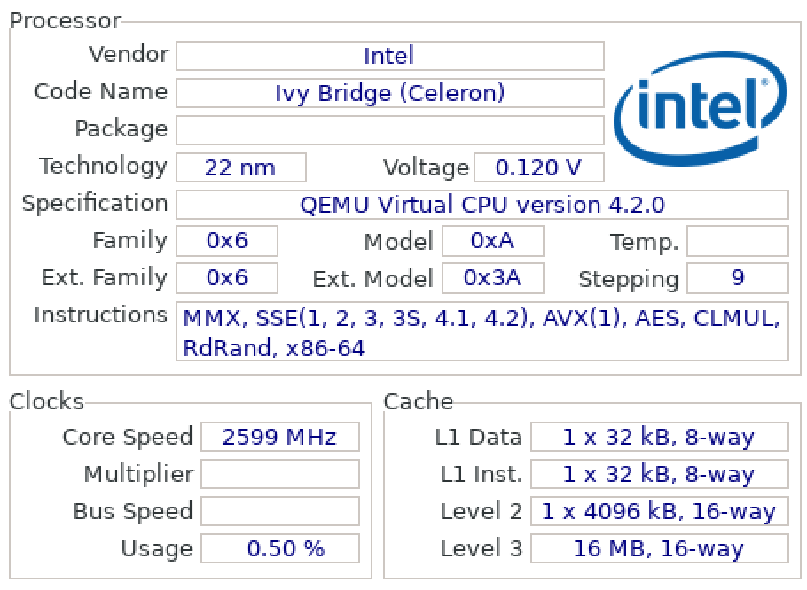

# Лабораторная работа: "Использование SIMD инструкций процессора для ускорения работы программы."

## Задача

### 1) Написать три варианта программы, рисующей фрактал Мандельброта:
- **1 вариант:** `Наивная реализация:` программа без каких-либо улучшений.
- **2 вариант:** `Векторная реализация:` использовать массивы из 8 элементов.
- **3 вариант:** `SIMD реализация:` использовать SIMD инструкции, поддерживаемые процессором.

### 2) Сравнить скорости работы трех вариантов программы.

### 3) Ответить на вопрос: удалось ли обогнать оптимизатор?

## Используемое оборудование

### Программы запускаются и тестируются на удаленном сервере:
**Данные о СPU:**

**Операционная система:** Linux Ubuntu 22.04

**Компилятор:** `gcc version 11.4.0`, target: `x86_64-linux-gnu`

## Ход работы

###  Построение фрактала Мандельброта

**Точки рассчитываются по следующей формуле:**
- xn = xn-12 - yn-12 + x0
- yn = 2 * xn-1yn-1 + y0

**Формат изображения:**

- Размер изображения: 800*600 пикселей
- Радиус окружности, при выходе за которую, расчет точек прекращается: 10
- Максимальный индекс точки, при котором считается, что она не покинула окружность: 255
- Цвет пикселя, заданный для библиотеки SFML, в зависимости от индекс `N` точки:
  - если `N` >= 256, то точка черная
  - если `N` < 256, то

    | R        | G            | B  | Alpha |
    |:--------:|:------------:|:--:|:-----:|
    | 255 - `N` | `N` % 8 * 32 | `N` | 255 |

### Полученное изображение

### Способ измерения времени работы программы:
- количество тактов измеряется при помощи функции __rdtsc()
- время исполнения измеряется при помощи функции clock()
- замеряется программа, 105 раз рассчитывающая все пиксели изображения
- измерение проводится 100 раз, в таблицах приведены усредненные значения
- <ins>характерное количество тактов</ins>  - количество тактов, затраченных на 100-кратный расчет пикселей для изображения первой версией программы
- <ins>характерное время работы программы</ins> - время, затраченное на расчет пикселей для изображения 100 раз первой версией программы

### Таблицы с результатами содержат следующие данные
  - первый столбец - уровень оптимизации
  - второй столбец - кол-во затраченных тактов процессора для единократного расчета всех пикселей
  - третий столбце - время расчета одного всех пикселей

### Первая версия программы

 1) В первой версии программы не применялись никакие оптимизации.

|Оптимизация|Кол-во тактов * 109  | Время, c|
|:---------:|:-------------:|:----------------:|
|    -O2    |  20.66  | 7.7 |
|    -O3    |  21.08  | 7,9 |

### Вторая версия программы

 2) Во второй программе в вычислениях участвуют восьми элементные массивы. Это позволяет оптимизатору самостоятельно вставлять SIMD инструкции.

|Оптимизация|Кол-во тактов  |
|:---------:|:-------------:|
|    -O2    | 30746534403   |
|    -O3    |  4612440772   |

### Третья версия программы

 3) В третьей версии напрямую использованы SIMD инструкции: AVX, AVX2.

|Оптимизация|Кол-во тактов * 109  | Время, c|
|:---------:|:-------------:|:----------------:|
|    -O2    |  3.14  | 1.1 |
|    -O3    |  2.79  | 1,1 |

Использование SIMD инструкций целесообразно только при уровне оптимизации не ниже -O1. Вот как на сайте https://godbolt.org компилятор x86-64 gcc 13.2 трансилрует код при разных уровнях оптимизации

1) `Флаги: -O0 -mavx -mavx2`

<figure>
<figcaption>Исходный код</figcaption>

</figure>

<figure>
<figcaption>Полученный код</figcaption>
 cringe O0.png" width="600">
</figure>

2) `Флаги: -O1 -mavx -mavx2`

<figure>
<figcaption>Исходный код</figcaption>

</figure>

<figure>
<figcaption>Полученный код</figcaption>
 WOW O1.png" width="600">
</figure>

В первом случае перед выполнение одной `SIMD` инструкции

 ### Все результаты представлены в таблице ниже, все программы скомпилированы с флагом оптимизации -O3. В третьем столбце представлено отношение скорости работы программ по отношению к первому варианту программы.

|Программа  |Кол-во тактов  | Отношение скорости         |
|:---------:|:-------------:|:---------:|
|       1   |   210271065   |  1.0      |
|       2   |  4612440772   |  0.046    |
|       3   |    60371086   |  3.48     |

## Вывод:

Использование для работы удаленного сервера оказывает сильное влияние на скорость работы, поэтому полученные результаты нельзя считать абсолютно точными.
Тем не менее видно, что использование SIMD инструкций на порядок ускоряет работу программы. В результате удалось обогнать оптимизатор примерно в 3.48 раза.